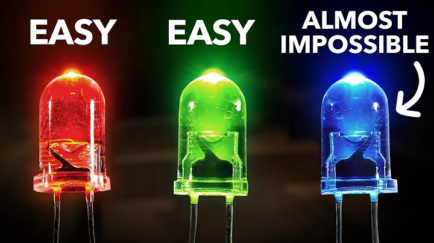

# ESP32 RGB LED

A tiny ESP32 project controlling three LEDs.

  

## The Process

🔴 Red — easy.

🟢 Green — easy.

🔵 Blue —

> **But blue was almost impossible to make.**

### 8 seconds later...

🔵 **IT WORKS.**

## About

Built with an **ESP32 DevKit V1**, breadboard, LEDs, resistors, and jumper wires.

The complete wiring and source code are included in this repository.

Use the latest release to rebuild it https://github.com/ssh-ak74/esp32-led-thing/releases/tag/esp32

## Open Source

Made open-source because if I build it, you should be able to see how it works.

Licensed under the **MIT License**.
